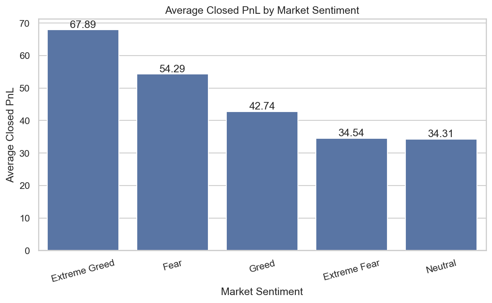
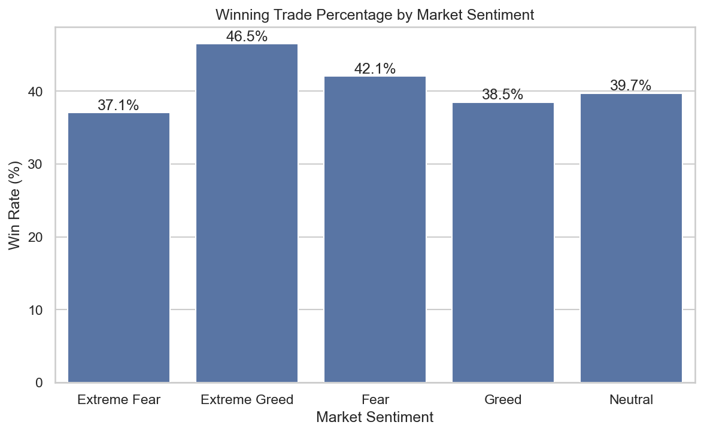
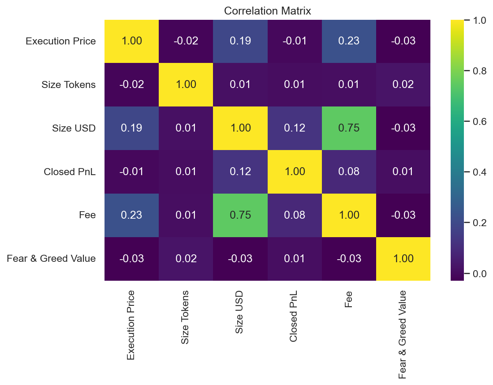

# 📈 PrimeTrade AI: Market Sentiment vs Trader Performance Analysis

## 📌 Project Overview

This project analyzes the relationship between **Bitcoin Market Sentiment (Fear & Greed Index)** and **historical trader performance** using exploratory data analysis (EDA).

The objective is to understand whether market sentiment influences trading profitability, win rate, and trading behavior.

This project was completed as part of the **PrimeTrade AI Internship Assessment**.

---

## 📂 Dataset

### 1. Historical Trader Data
Contains detailed trading information, including:

- Account
- Coin
- Execution Price
- Trade Size
- Side (Buy/Sell)
- Closed Profit & Loss
- Fees
- Timestamp

### 2. Bitcoin Fear & Greed Index

Contains daily Bitcoin market sentiment:

- Extreme Fear
- Fear
- Neutral
- Greed
- Extreme Greed

---

## 🛠️ Technologies Used

- Python
- Pandas
- NumPy
- Matplotlib
- Seaborn
- Jupyter Notebook

---

## 📊 Methodology

### Data Preprocessing

- Loaded both datasets
- Inspected data quality
- Removed inconsistencies
- Converted timestamps
- Created new date-based features
- Merged datasets using Trade Date
- Validated merge results

---

### Exploratory Data Analysis

The following analyses were performed:

- Market Sentiment Distribution
- Closed PnL Distribution
- Average Profit by Sentiment
- Win Rate Analysis
- Buy vs Sell Analysis
- Coin-wise Analysis
- Trading Volume Analysis
- Daily Trading Activity
- Correlation Analysis

---

## 🔍 Key Findings

- Traders achieved the highest average profits during **Extreme Greed** market conditions.
- Win rates were also highest during **Extreme Greed**.
- Fear periods showed relatively strong profitability, suggesting experienced traders may capitalize on market downturns.
- Trading fees strongly increased with trade size.
- Market sentiment showed weak direct linear correlation with numerical variables but influenced overall trading performance.

---

## 📁 Project Structure

```
primetrade-ai-market-sentiment-analysis/
│
├── data/
│   ├── raw/
│   └── processed/
│
├── notebooks/
│   └── PrimeTrade_EDA.ipynb
│
├── outputs/
│
├── reports/
│
├── requirements.txt
│
└── README.md
```

---

## 🚀 Installation

Clone the repository

```bash
git clone https://github.com/YOUR_USERNAME/primetrade-ai-market-sentiment-analysis.git
```

Install dependencies

```bash
pip install -r requirements.txt
```

Run

```bash
jupyter notebook
```

---

## Results

### Average Closed PnL by Market Sentiment



### Win Rate by Market Sentiment



### Correlation Matrix



## 📈 Conclusion

This project demonstrates how external market sentiment indicators can be integrated with trading data to understand trader behavior and profitability.

The analysis highlights that trader performance varies across different market conditions and that sentiment can provide valuable context for trading decisions.

---

## 👩‍💻 Author

**Pooja Balpande**

B.Tech Artificial Intelligence & Data Science

AISSMS Institute of Information Technology

Pune, India